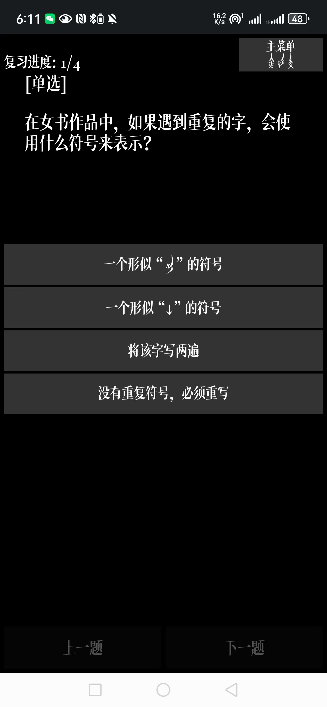
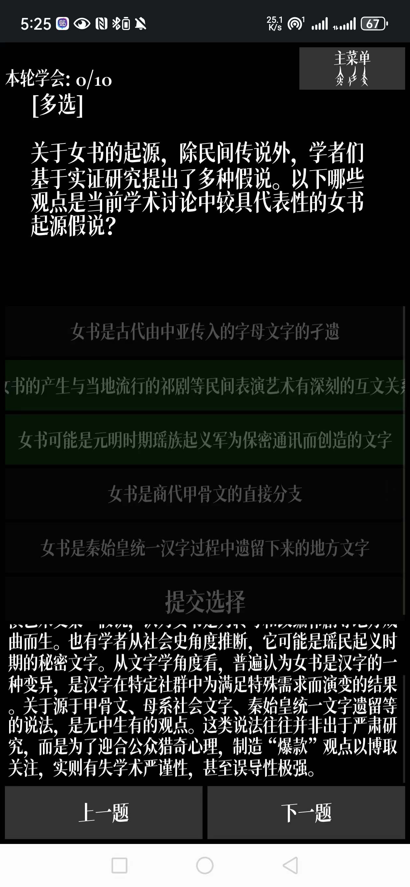
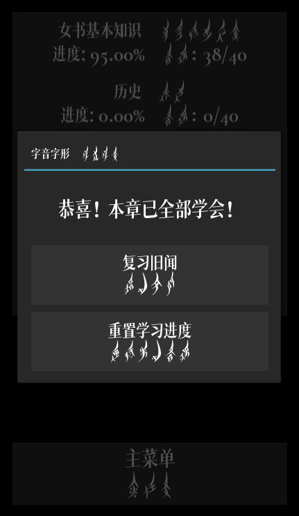
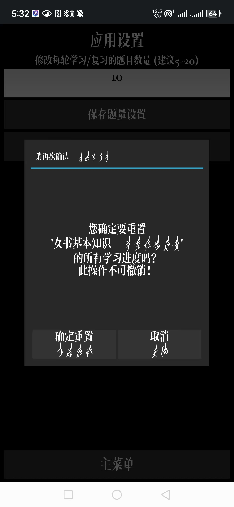
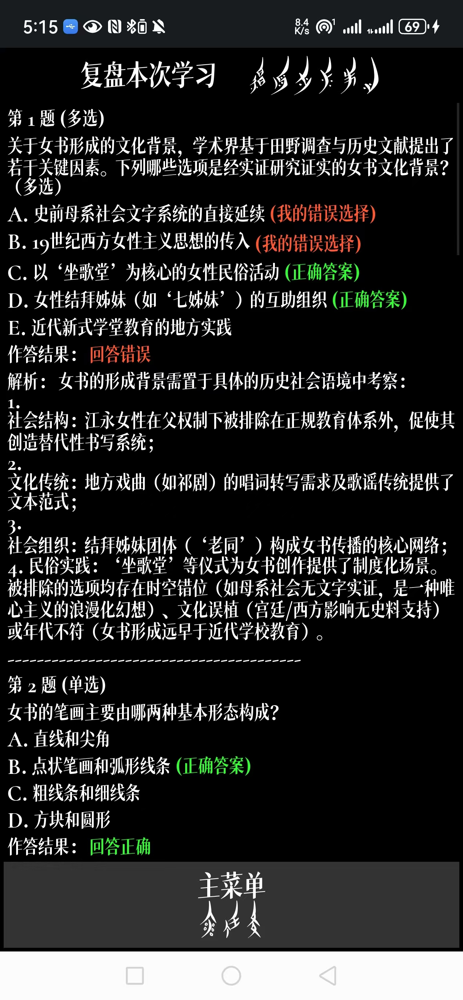
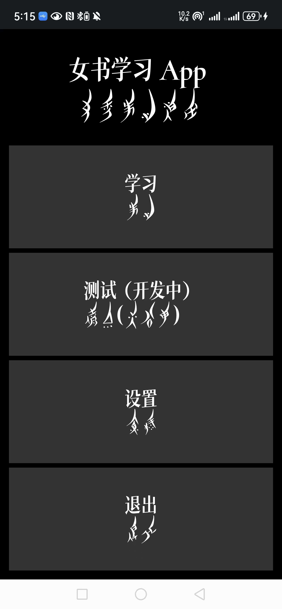

# 女书学习 App ．Nvshu Learning App 📖🌸


这是一个面向大众用户设计的**女书知识学习应用**，集知识问答、章节学习、复盘反馈于一体，适配移动端与桌面环境，致力于**推动女书文化的传播与认知**。本应用已成功部署至 Android 平台，支持 APK 安装使用。

---

## 🧠 项目简介

本项目围绕湖南江永地区的非遗文化“女书”展开，结合我们团队在清华大学的社会实践成果，开发出这款交互式学习工具。

项目功能汇缩：

- ✅ 分章节学习女书知识（基础、历史、地理、字符等）
- ✅ 多轮答题与即时反馈
- ✅ 支持复盘本轮学习内容（含错题、解释、答案）
- ✅ 自定义学习题量，跟踪章节进度
- ✅ 适配 Android 安卓平台，可直接安装使用
- ✅ 兼容女书字体显示（考虑到排版，未严格按照女书“从右到左，从上到下”的行款），沉淀式文化体验

---

## 📱 应用截图展示

| 学习界面 | 答题反馈 | 学习完成 |
| -------- | -------- | -------- |
|  |  |  |

| 重置进度 | 复盘界面 | 主菜单 |
| -------- | -------- | ------ |
|  |  |  |

（以上截图来自实际运行效果）

---

## 📦 安装方式

---

### 📂 下载源码

1. 打开 GitHub 项目主页
2. 点击绿色的 `Code` 按钮
3. 选择 `Download ZIP`
4. 解压后得到项目文件夹

### ⚙️ 安装依赖

确保已安装 Python 3.9+，推荐使用虚拟环境。

```bash
pip install kivy
```

如需安卓打包：

```bash
pip install buildozer
```

### 🚀 如何运行（PC端）

```bash
cd Nvshu-Learning-App-main  # 进入 main.py 所在目录，这取决于你解压后该文件夹的位置，你可以复制文件夹的路径得到（Ctrl+Shift+V）
python main.py
```


需安装依赖：

- Python 3.11+
- Kivy >= 2.3
- Buildozer (如需打包 APK)

### 📲 Android 用户安装 APK

你可以直接下载安装打包好的 APK 文件：

👉 [点击下载 APK 安装包](./dist/nvshu_app-release.apk)

安装后即可在安卓设备上运行，无需额外依赖。

---

## 📁 项目结构

```
nvshu_app/
├── main.py                  # 主程序入口
├── app.kv                  # Kivy UI 布局文件
├── review_screen.py        # 复盘界面逻辑
├── learning_screen.py      # 学习主界面逻辑
├── data/                   # 存储题库数据和用户进度
├── fonts/                  # 女书字体文件 NvshuFont.ttf
├── images/                 # 图标与 UI 素材
└── buildozer.spec          # 安卓打包配置文件
```


## 🛠 技术栈

- Python 3
- Kivy & KivyMD
- Android打包：Buildozer + SDL2
- 自定义女书字体（.ttf）
- JSON数据存储结构
- ADB 日志调试

---

## 📚 背景与意义

女书是一种**世界唯一的女性专属文字体系**，主要流传于湖南江永地区，本项目旨在通过数字化手段保存与传播女书文化，增强大众对其历史背景与文化价值的理解。

---

## 🙏 特别致谢

- 赵丽明教授（指导老师）
- 致理书院“清纫书永”实践支队全体成员
- Gemini, ChatGPT, Deepseek等LLM的大力帮助
- 所有支持本项目的朋友们！

---

> “女书，不仅是文字，更是记忆、情感与生命的纹理。” —— Nvshu App 团队

